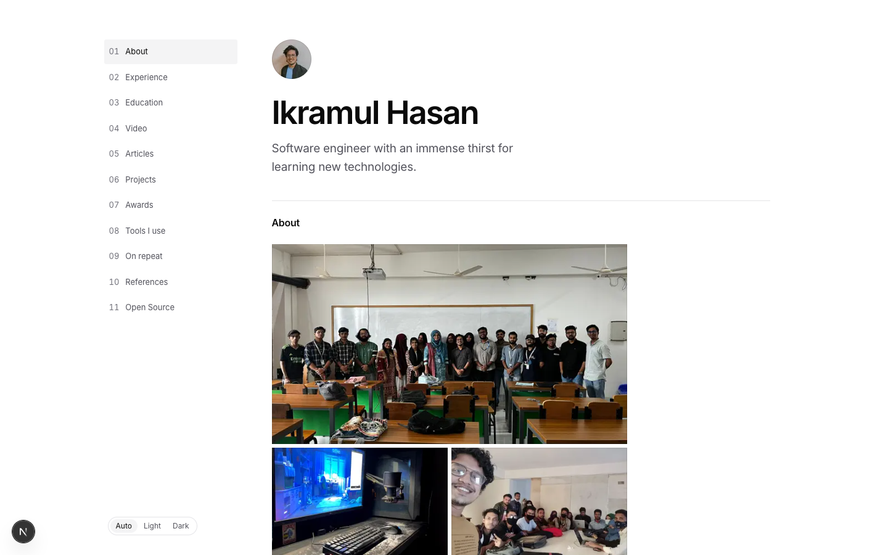
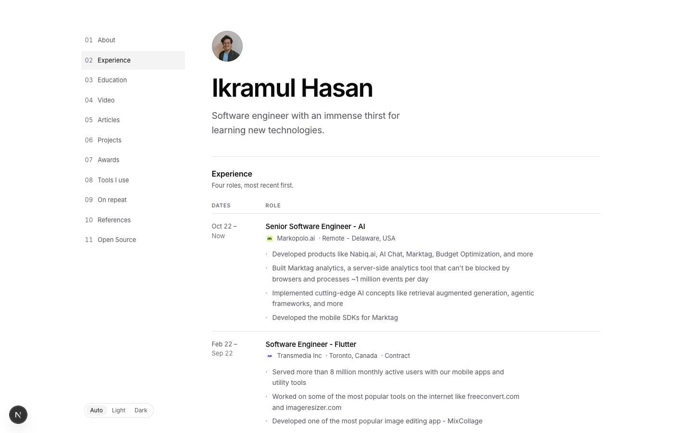
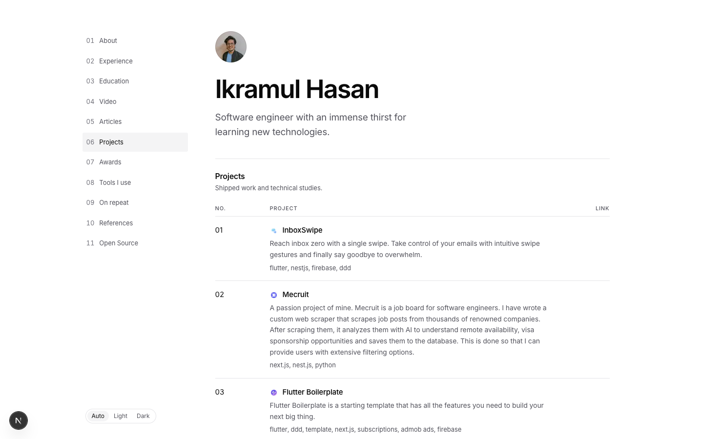
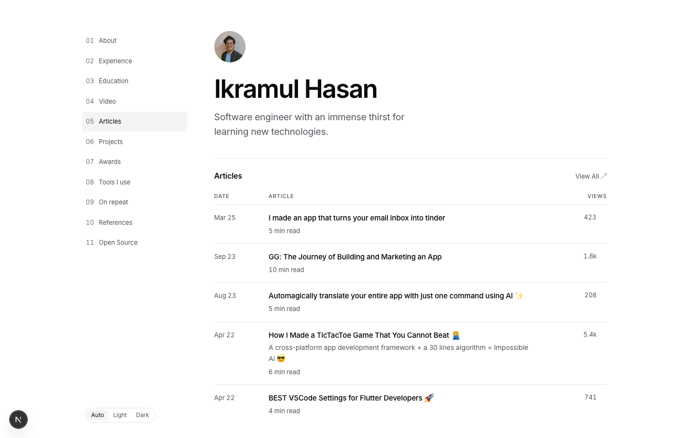
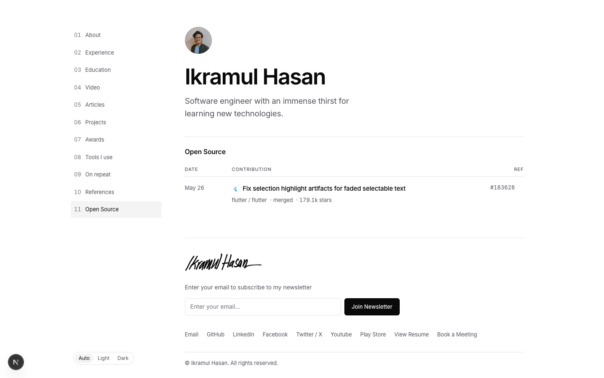
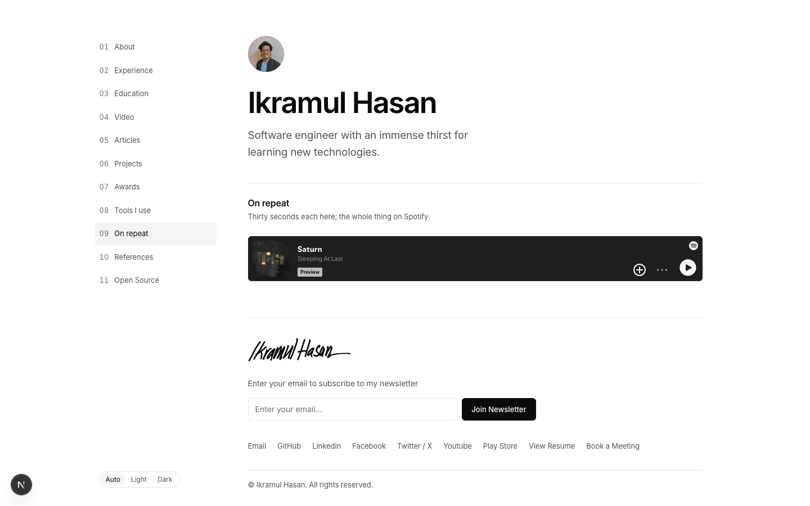
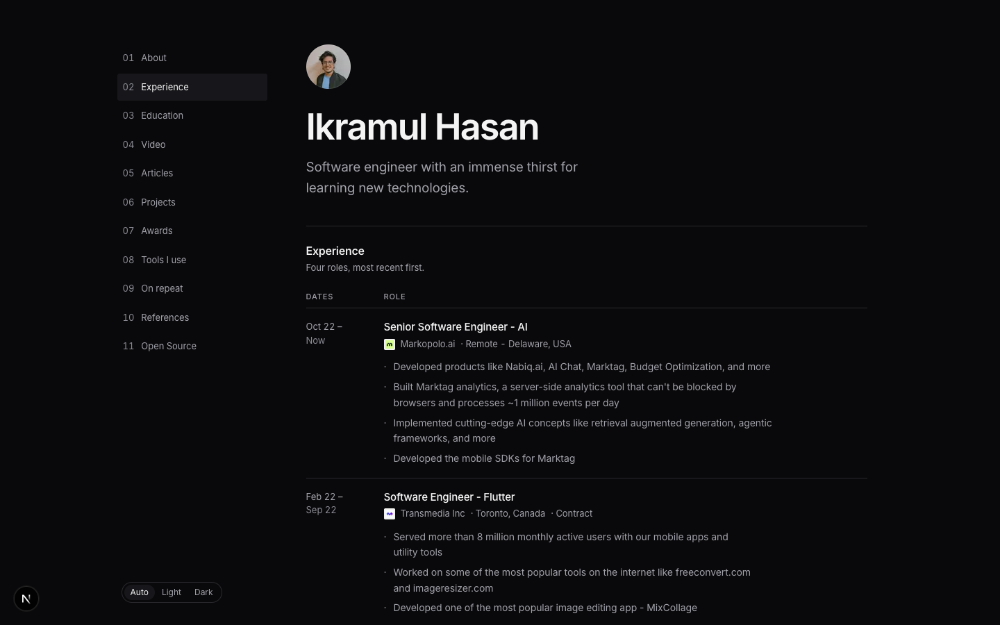

# Portfolio

A single-page portfolio: a sticky index rail on the left, one section at a time on the
right, switched as tabs. Every section — profile, experience, projects, articles, tools,
music, open source — lives in Convex and is edited at `/admin`, so nothing is hardcoded
into the build. Pages are prerendered and refreshed a section at a time as that section
is saved.

Next.js 16, React 19, Convex, Tailwind CSS v4, Plate, Biome.

## Setup

```bash
pnpm install
pnpm dev
```

`pnpm dev` pushes `convex/` to the dev deployment and starts Next.js beside it. Open
[localhost:3000](http://localhost:3000) — a fresh deployment is empty until you fill it
in at `/admin`.

There is one account and no way to make a second: set `ADMIN_EMAIL`, then claim it at
`/signin` with that address. Sign-up closes after, and there is no reset —
`pnpm release-account` deletes the account so it can be claimed again, content intact.

Auth needs a keypair too. Generate `JWT_PRIVATE_KEY` and `JWKS` with:

```bash
node -e 'import("jose").then(async({generateKeyPair,exportPKCS8,exportJWK})=>{
  const k=await generateKeyPair("RS256",{extractable:true});
  const priv=await exportPKCS8(k.privateKey), pub=await exportJWK(k.publicKey);
  console.log(JSON.stringify({JWT_PRIVATE_KEY:priv.trimEnd().replace(/\n/g," "),
    JWKS:JSON.stringify({keys:[{use:"sig",...pub}]})}))})'
```

Set them with `npx convex env set "NAME=VALUE"`; the `NAME VALUE` form breaks on the
private key, which starts with a dash.

Convex deployment: `ADMIN_EMAIL`, `JWT_PRIVATE_KEY`, `JWKS`, `SITE_URL` (the site's
origin, not the deployment's), optionally `GITHUB_TOKEN`.

Web host: `NEXT_PUBLIC_CONVEX_URL`, `NEXT_PUBLIC_SITE_URL`, `REVALIDATE_SECRET`,
`CONVEX_DEPLOY_KEY`, optionally `GOOGLE_GENERATIVE_AI_API_KEY` for the editor's AI
features. A production build prerenders, so it needs a deployment that already has
content.

## Screenshots














