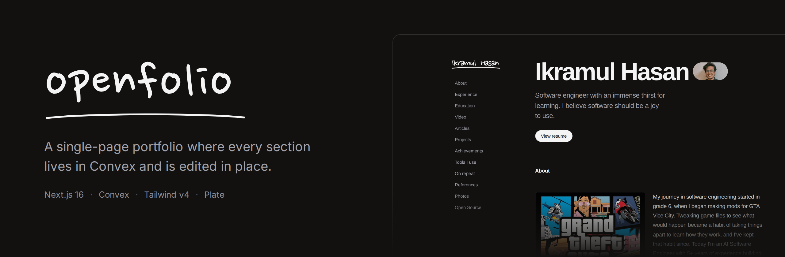
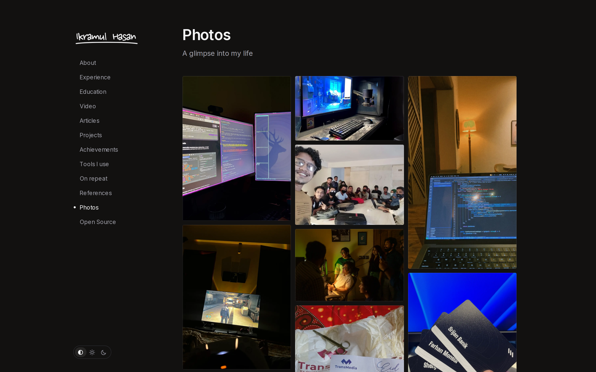
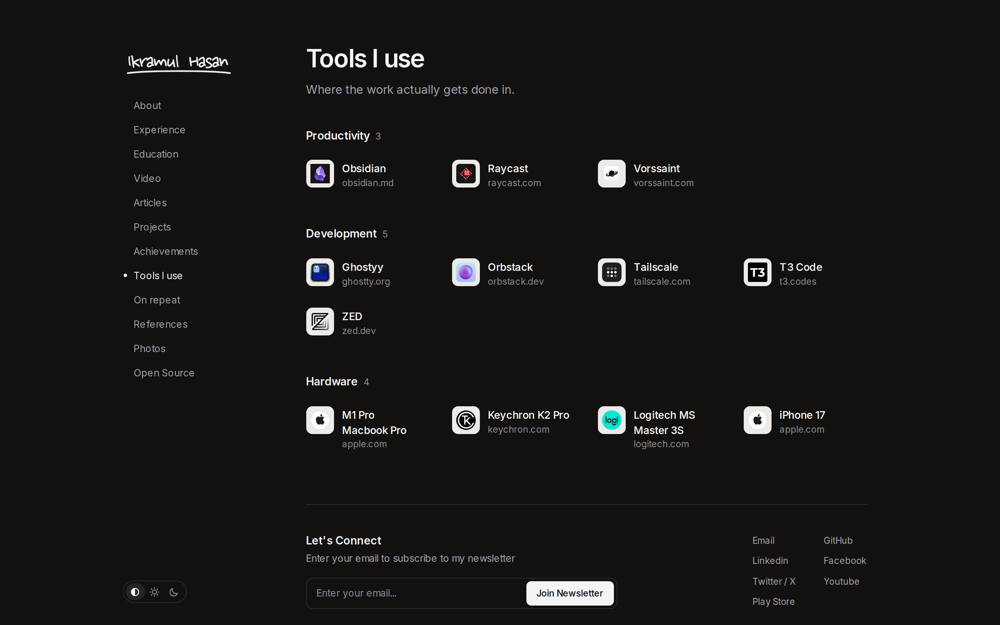
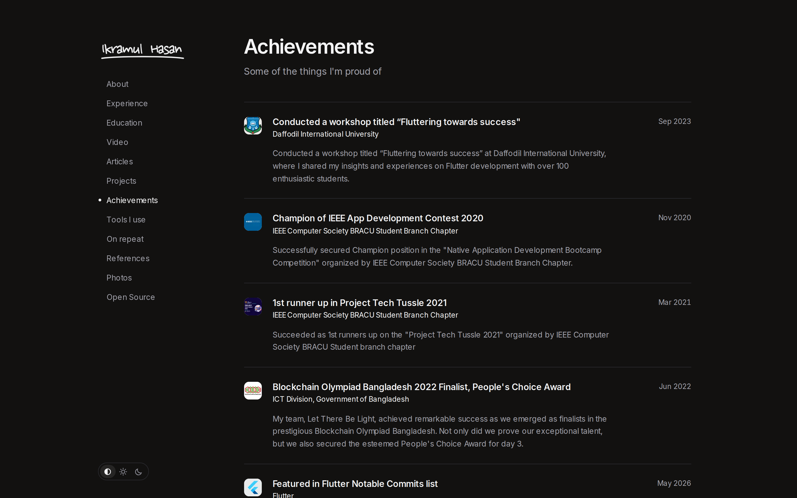
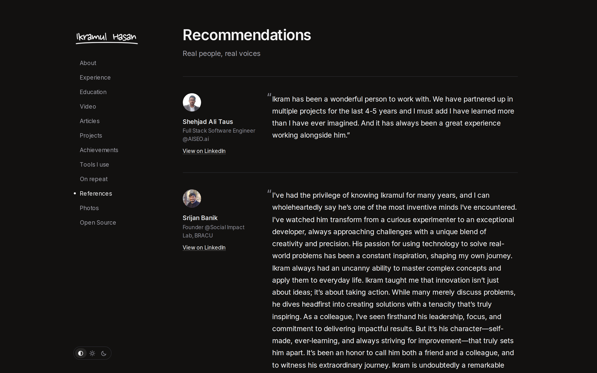
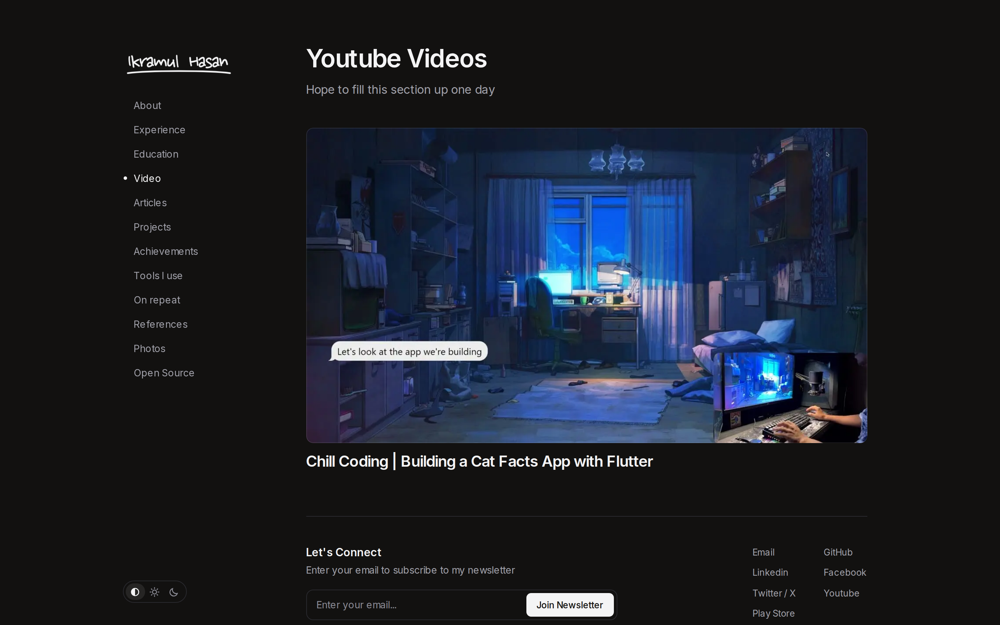
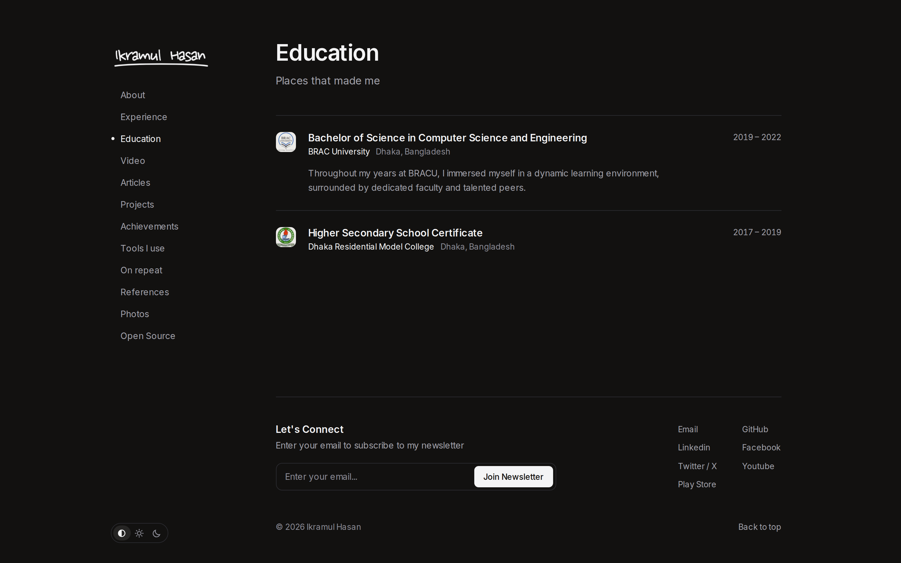

<p align="center">
  
</p>

<p align="center">
  <a href="https://ikramhasan.com?ref=github.com">Live site</a>
  ·
  <a href="#getting-started">Getting started</a>
  ·
  <a href="#deploying">Deploying</a>
  ·
  <a href="#screenshots">Screenshots</a>
</p>

A single-page portfolio: a sticky index rail on the left, one section at a time on the
right, switched as tabs. Every section — profile, experience, projects, articles, tools,
music, open source — lives in Convex and is edited at `/admin`, so nothing is hardcoded
into the build. Pages are prerendered and refreshed a section at a time as that section
is saved.

## Highlights

- **Content in the database, not the repo.** Every section is edited at `/admin` and
  stored in Convex.
- **Static, but never stale.** Pages are prerendered; saving a section revalidates only
  that section.
- **A real editor.** Articles are written in Plate, with optional AI features.
- **Light and dark.** Follows the system theme, with a toggle in the rail.
- **One owner.** A single admin account, claimed once, with no sign-up afterwards.

## Stack

| | |
| --- | --- |
| Framework | Next.js 16, React 19 |
| Backend | Convex, Convex Auth |
| Styling | Tailwind CSS v4 |
| Editor | Plate |
| Tooling | Biome, pnpm |

## Screenshots

<table>
  <tr>
    <td colspan="2"></td>
  </tr>
  <tr>
    <td width="50%"></td>
    <td width="50%"></td>
  </tr>
  <tr>
    <td></td>
    <td></td>
  </tr>
  <tr>
    <td></td>
    <td></td>
  </tr>
  <tr>
    <td></td>
    <td></td>
  </tr>
  <tr>
    <td></td>
    <td></td>
  </tr>
</table>

## Getting started

```bash
pnpm install
pnpm dev
```

`pnpm dev` pushes `convex/` to the dev deployment and starts Next.js beside it. Open
[localhost:3000](http://localhost:3000) — a fresh deployment is empty until you fill it
in at `/admin`.

### The admin account

There is one account and no way to make a second: set `ADMIN_EMAIL`, then claim it at
`/signin` with that address. Sign-up closes after, and there is no reset —
`pnpm release-account` deletes the account so it can be claimed again, content intact.

### Auth keys

Auth needs a keypair too. Generate `JWT_PRIVATE_KEY` and `JWKS` with:

```bash
node -e 'import("jose").then(async({generateKeyPair,exportPKCS8,exportJWK})=>{
  const k=await generateKeyPair("RS256",{extractable:true});
  const priv=await exportPKCS8(k.privateKey), pub=await exportJWK(k.publicKey);
  console.log(JSON.stringify({JWT_PRIVATE_KEY:priv.trimEnd().replace(/\n/g," "),
    JWKS:JSON.stringify({keys:[{use:"sig",...pub}]})}))})'
```

> [!IMPORTANT]
> Set them with `npx convex env set "NAME=VALUE"`; the `NAME VALUE` form breaks on the
> private key, which starts with a dash.

## Environment variables

**Convex deployment**

| Variable | Required | Notes |
| --- | --- | --- |
| `ADMIN_EMAIL` | Yes | The address allowed to claim the admin account |
| `JWT_PRIVATE_KEY` | Yes | See [Auth keys](#auth-keys) |
| `JWKS` | Yes | See [Auth keys](#auth-keys) |
| `SITE_URL` | Yes | The site's origin, not the deployment's |
| `GITHUB_TOKEN` | No | Lets the Open Source editor fetch pull requests and issues |

`GITHUB_TOKEN` avoids GitHub's shared-IP rate limit. Create a fine-grained token at
github.com/settings/personal-access-tokens/new with "Public repositories" access and
no extra permissions, then run `npx convex env set GITHUB_TOKEN=github_pat_...`
(add `--prod` for the production deployment).

**Web host**

| Variable | Required | Notes |
| --- | --- | --- |
| `NEXT_PUBLIC_CONVEX_URL` | Yes | |
| `NEXT_PUBLIC_SITE_URL` | Yes | |
| `REVALIDATE_SECRET` | Yes | |
| `CONVEX_DEPLOY_KEY` | Yes | |
| `GOOGLE_GENERATIVE_AI_API_KEY` | No | Enables the editor's AI features |

A production build prerenders, so it needs a deployment that already has content.

## Deploying

On Vercel, `vercel.json` runs `npm run build:vercel`, which wraps `next build` in
`convex deploy`. Give Production a production deploy key and Preview a preview deploy
key as `CONVEX_DEPLOY_KEY`. A preview branch gets a fresh, empty Convex deployment,
and `convex deploy --cmd` runs the build before it pushes functions, so for previews
the script pushes functions first and then builds.

### Preview deployments

A new preview deployment is seeded by `seed:preview` with placeholder content for every
section and an admin account:

| Email | Password |
| --- | --- |
| `admin@example.com` | `password` |

Sign in at `/signin`. The seed runs only when Convex creates the preview deployment, and
it does nothing on a deployment that already has content. Set the Convex deployment
variables above as the project's default environment variables for preview deployments
in the Convex dashboard so sign-in works there.
