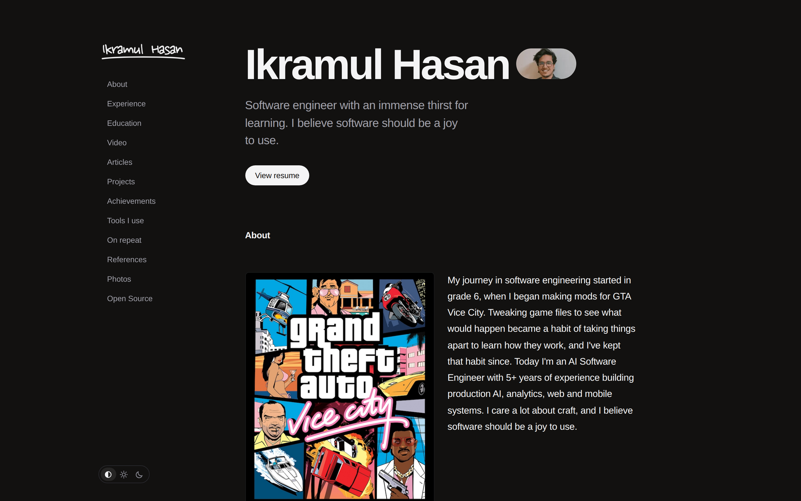
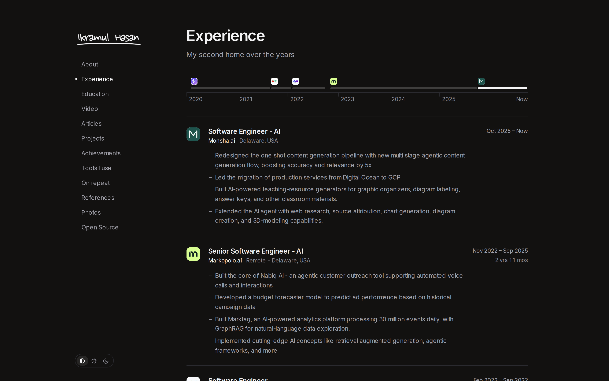
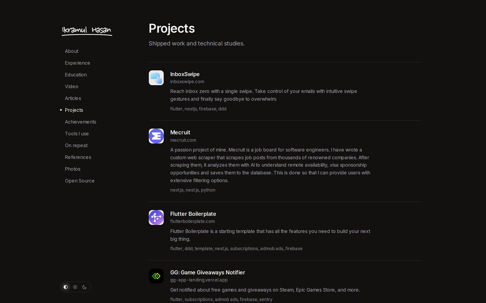
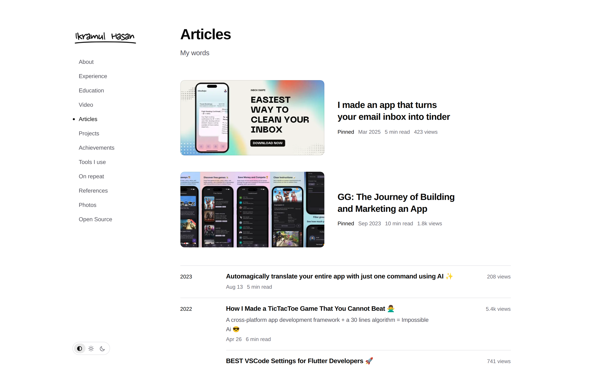
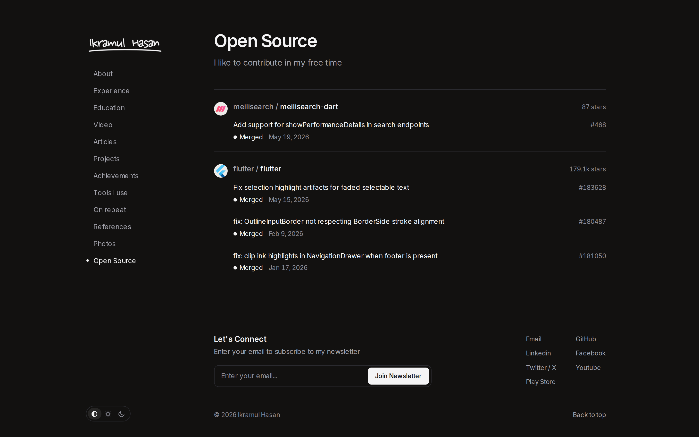
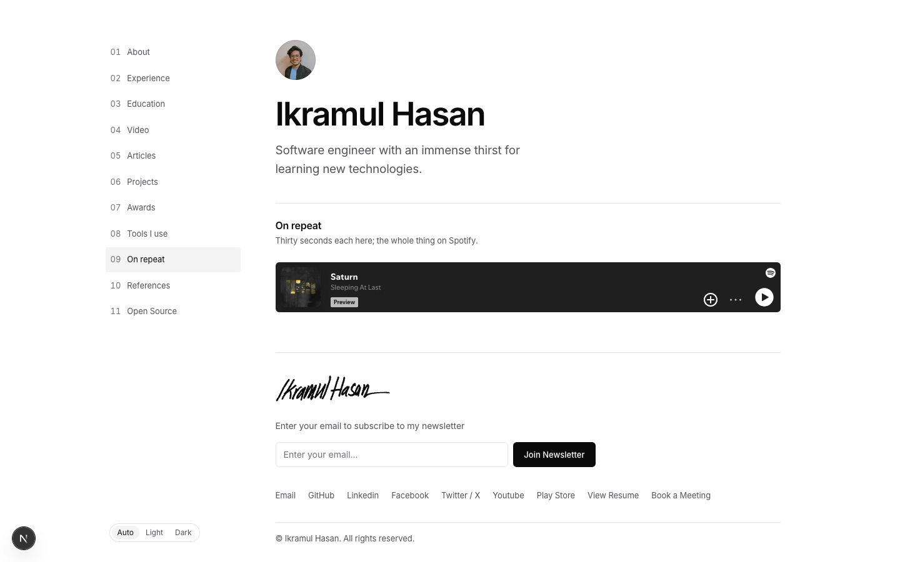
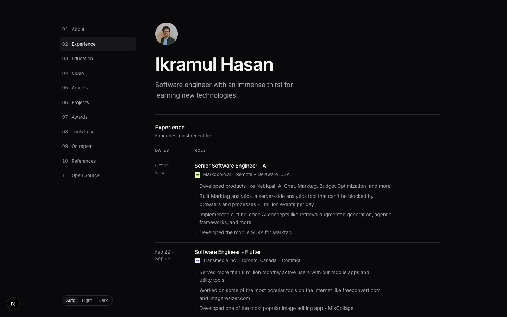

# Portfolio

A single-page portfolio: a sticky index rail on the left, one section at a time on the
right, switched as tabs. Every section — profile, experience, projects, articles, tools,
music, open source — lives in Convex and is edited at `/admin`, so nothing is hardcoded
into the build. Pages are prerendered and refreshed a section at a time as that section
is saved.

Next.js 16, React 19, Convex, Tailwind CSS v4, Plate, Biome.

## Setup

```bash
pnpm install
pnpm dev
```

`pnpm dev` pushes `convex/` to the dev deployment and starts Next.js beside it. Open
[localhost:3000](http://localhost:3000) — a fresh deployment is empty until you fill it
in at `/admin`.

There is one account and no way to make a second: set `ADMIN_EMAIL`, then claim it at
`/signin` with that address. Sign-up closes after, and there is no reset —
`pnpm release-account` deletes the account so it can be claimed again, content intact.

Auth needs a keypair too. Generate `JWT_PRIVATE_KEY` and `JWKS` with:

```bash
node -e 'import("jose").then(async({generateKeyPair,exportPKCS8,exportJWK})=>{
  const k=await generateKeyPair("RS256",{extractable:true});
  const priv=await exportPKCS8(k.privateKey), pub=await exportJWK(k.publicKey);
  console.log(JSON.stringify({JWT_PRIVATE_KEY:priv.trimEnd().replace(/\n/g," "),
    JWKS:JSON.stringify({keys:[{use:"sig",...pub}]})}))})'
```

Set them with `npx convex env set "NAME=VALUE"`; the `NAME VALUE` form breaks on the
private key, which starts with a dash.

Convex deployment: `ADMIN_EMAIL`, `JWT_PRIVATE_KEY`, `JWKS`, `SITE_URL` (the site's
origin, not the deployment's), optionally `GITHUB_TOKEN`.

`GITHUB_TOKEN` lets the Open Source editor fetch pull requests and issues without
hitting GitHub's shared-IP rate limit. Create a fine-grained token at
github.com/settings/personal-access-tokens/new with "Public repositories" access and
no extra permissions, then run `npx convex env set GITHUB_TOKEN=github_pat_...`
(add `--prod` for the production deployment).

Web host: `NEXT_PUBLIC_CONVEX_URL`, `NEXT_PUBLIC_SITE_URL`, `REVALIDATE_SECRET`,
`CONVEX_DEPLOY_KEY`, optionally `GOOGLE_GENERATIVE_AI_API_KEY` for the editor's AI
features. A production build prerenders, so it needs a deployment that already has
content.

On Vercel, `vercel.json` runs `npm run build:vercel`, which wraps `next build` in
`convex deploy`. Give Production a production deploy key and Preview a preview deploy
key as `CONVEX_DEPLOY_KEY`. A preview branch gets a fresh, empty Convex deployment,
and `convex deploy --cmd` runs the build before it pushes functions, so for previews
the script pushes functions first and then builds.

A new preview deployment is seeded by `seed:preview` with placeholder content for every
section and an admin account: sign in at `/signin` as `john.doe@example.com` with the
password `password`. It runs only when Convex creates the preview deployment, and it does
nothing on a deployment that already has content. Set the Convex deployment variables
above as the project's default environment variables for preview deployments in the
Convex dashboard so sign-in works there.

## Screenshots














